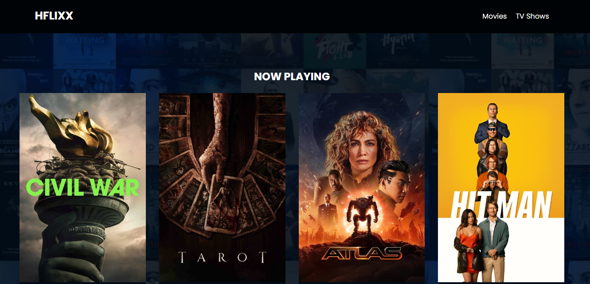
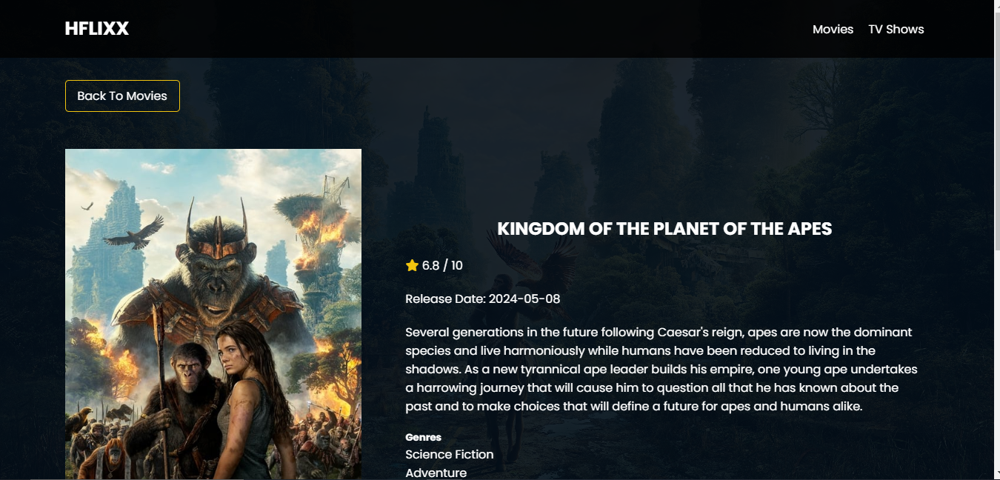
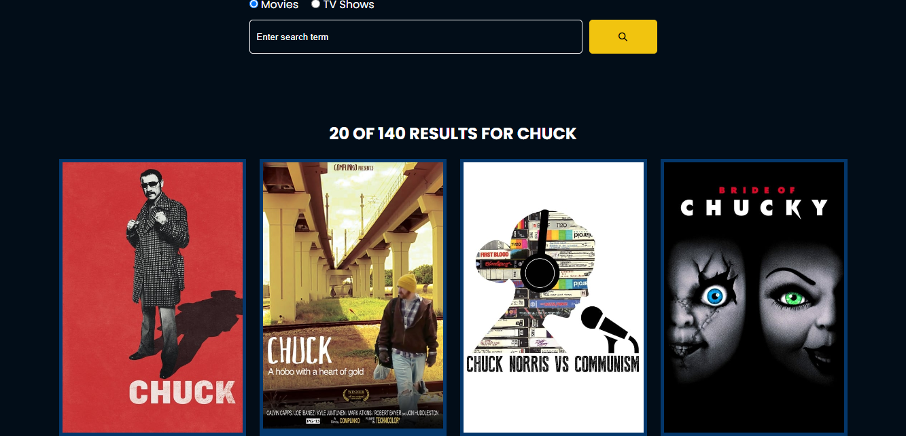

# HFlixx

Welcome to HFlixx, your go-to web application for exploring movies and TV shows! This README will guide you through the features, functionalities, and setup of the HFlixx web app.

## Table of Contents
- [Features](#features)
- [Technologies Used](#technologies-used)
- [Installation](#installation)
- [Usage](#usage)
- [API Key](#api-key)
- [Project Structure](#project-structure)
- [Screenshots](#screenshots)
- [Contributing](#contributing)
- [License](#license)

## Features

- **Now Playing Slider**: Browse the latest movies currently playing in theaters.
- **Search Functionality**: Find your favorite movies and TV shows with ease.
- **Popular Movies**: Discover the most popular movies.
- **Popular TV Shows**: Check out the most popular TV shows.
- **Detailed Information**: Get detailed information about movies and TV shows, including ratings, genres, release dates, and production companies.
- **Responsive Design**: Enjoy a seamless experience on any device.
- **Social Media Links**: Connect with us on various social media platforms.

## Technologies Used

- **HTML5**: Structure and content of the web pages.
- **CSS3**: Styling the application for an appealing and responsive design.
- **JavaScript**: Implementing the interactive features.
- **Swiper.js**: Creating the responsive slider for now playing movies.
- **FontAwesome**: Providing icons for the user interface.
- **The Movie Database (TMDb) API**: Fetching movie and TV show data.

## Installation

To run this project locally, follow these steps:

1. **Clone the repository**:
   ```bash
   git clone https://github.com/HopSoft-Tech/HFlixx.git
   cd HFlixx
   ```

2. **Open the project in your preferred code editor**.

3. **API Key**: Register for an API key at [TMDb](https://www.themoviedb.org/settings/api). Create a file named `config.js` in the `js` directory and add your API key:
   ```javascript
   const API_KEY = 'your_api_key_here';
   ```

4. **Open `index.html` in your browser** to view the application.

## Usage

### Home Page

- **Now Playing Slider**: Automatically displays the latest movies currently playing in theaters.
- **Popular Movies**: Displays the top 20 most popular movies.

### TV Shows Page

- **Popular TV Shows**: Lists the top 20 most popular TV shows.

### Search

- **Search Bar**: Use the search bar to find movies or TV shows by title.
- **Search Filters**: Choose between Movies and TV Shows to narrow down your search.

### Details Page

- **Movie Details**: Click on a movie to see detailed information, including the synopsis, release date, genres, budget, revenue, runtime, and production companies.
- **TV Show Details**: Click on a TV show to see detailed information, including the synopsis, last air date, number of episodes, status, and production companies.

## API Key

To use the TMDb API, you need an API key. Follow these steps:

1. Register for an API key at [TMDb](https://www.themoviedb.org/settings/api).
2. Create a file named `config.js` in the `js` directory.
3. Add your API key to the `config.js` file:
   ```javascript
   const API_KEY = 'your_api_key_here';
   ```

## Project Structure

```
HFlixx/
├── css/
│   ├── style.css
│   ├── spinner.css
├── images/
│   ├── no-image.jpg
├── js/
│   ├── script.js
├── lib/
│   ├── swiper.css
│   ├── swiper.js
│   ├── fontawesome.css
├── index.html
├── shows.html
├── movie-details.html
├── tv-details.html
├── search.html
```

## Screenshots

### Home Page


### Movie Details


### TV Show Details


### Search Results


## Contributing

Contributions are welcome! Please fork this repository and submit pull requests for any improvements.

1. Fork the Project
2. Create your Feature Branch (`git checkout -b feature/AmazingFeature`)
3. Commit your Changes (`git commit -m 'Add some AmazingFeature'`)
4. Push to the Branch (`git push origin feature/AmazingFeature`)
5. Open a Pull Request

## License

Distributed under the MIT License. See `LICENSE` for more information.

---

Thank you for checking out HFlixx! We hope you enjoy using it as much as we enjoyed building it. If you have any questions or feedback, feel free to reach out via our [social media channels](#footer).

### Footer

Stay connected:
- [Facebook](https://web.facebook.com/hndukwo)
- [Twitter](https://twitter.com/HNdukwo)
- [LinkedIn](https://www.linkedin.com/in/hope-nduk/)
- [GitHub](https://github.com/HopSoft-Tech)

---

Happy Watching!

HopSoft-Tech